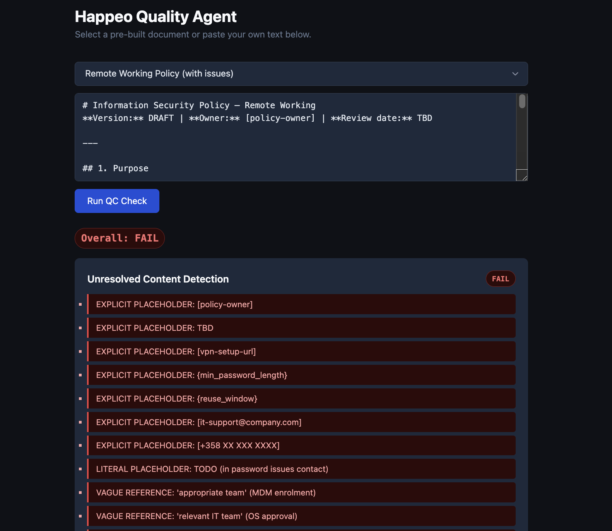
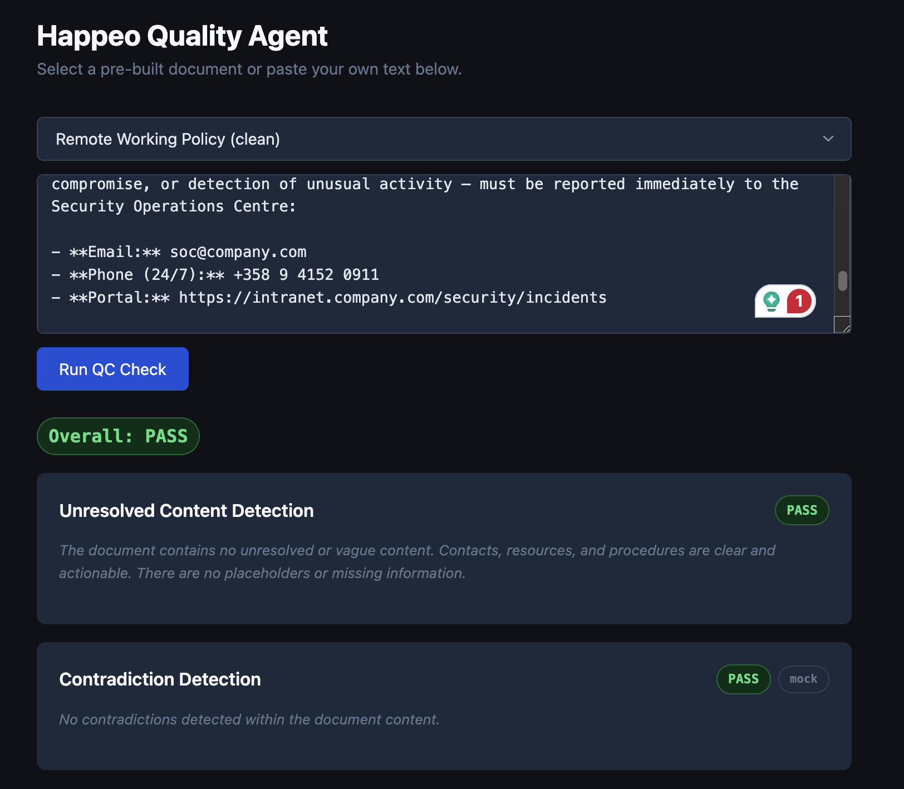

# Acme Knowledge QC Agent

A quality layer between AI content generation and publication in Acme's intranet.

## Run

```bash
uv run quality-agent-demo
```

## Project Structure

- `src/quality_agent_demo/` contains the production app and runtime QC logic.
- `experiments/unresolved_content_calibration/` contains the prompt and model calibration code for the unresolved-content judge.

---

## Problem

Acme's content agent is used by knowledge publishers — employees who manage the intranet — through a chat interface where they can instruct the agent to create or update pages: referencing a file from Google Drive, typing what should change, or describing a new policy from scratch. The agent interprets the request and handles the writing.

Without a systematic quality layer, these risks are hard to catch consistently — quality depends on the publisher spotting issues before hitting publish.

**Knowledge lifecycle and failure modes:**

**1. Creation**
- 1.a Source wrong or incomplete (GIGO)
- 1.b Source right but partial — placeholders or draft text survive into live content
- *(among others)*

**2. Publication / Generation**
- 2.a Faithful reproduction of source errors
- 2.b Hallucination — content looks authoritative but contains invented detail employees may act on
- 2.c Incomplete publication
- *(among others)*

**3. Maintenance**
- 3.a Staleness — employees follow outdated guidance without knowing it has changed
- 3.b Duplication (same knowledge in multiple places, diverging)
- 3.c Corpus contradiction — two policies conflict; an employee following one may be violating another
- 3.d Orphaned content (no owner, no maintenance, still live)
- *(among others)*

The tool architecture **assumes correctness** — there is no quality layer between generation and publication.

---

## Proposed Solution

**Acme Knowledge QC Agent** — a quality agent that sits between the existing content agent and publication event. Helps knowledge publishers maintain a high standard of knowledge in the company intranet.

When the content agent produces output, the QC Agent evaluates it against a set of quality criteria. If it passes, the page publishes. If it fails, the QC Agent catches the failure and sends a recommendation for the fix to the Content Agent or directly escalates to human review.

The QC Agent does not replace the existing agent. It adds the one capability the current architecture is missing: **a quality layer between generation and publication**.

**The QC Agent could be equipped with tools such as:**
- Unresolved content detection — catches placeholder text, missing contacts, and vague references before publish.
  - *Publisher value: know the page is actionable before it goes live, not after an employee hits a dead end.*
- Duplicate detection — surfaces existing pages covering the same knowledge.
  - *Publisher value: consolidate, redirect, or retire rather than letting two versions drift apart unnoticed.*
- Contradiction detection — flags when a new page conflicts with an existing one.
  - *Publisher value: resolve it deliberately rather than accidentally publishing a policy that undermines another.*
- Contact verification — validates referenced people and roles against the People directory.
  - *Publisher value: catch dead references before they go live, not when someone reports them broken.*
- Source-to-page drift detection — alerts when the source document has changed since the page was generated.
  - *Publisher value: re-generate or review rather than leaving content that no longer reflects the authoritative source.*
- *(extensible — new tools can be added per failure mode)*

Each tool has custom detection logic and produces a structured finding: what failed, why, and a recommendation for the Content Agent on how to fix it — or a direct escalation to human review.

## Architecture

```
Content Agent produces output
         ↓
QC Agent evaluates against criteria
         ↓
   PASS → publish
   FAIL → structured feedback → Content Agent retries
         ↓
   Max iterations or escalation recommendation → escalate to human
```

---

## Implemented Solution / Scoped Prototype

This submission proposes a broader QC agent architecture and multiple possible quality check functions/tools but only implements few chosen one due to time and scope constraints.

The scoped write-up below focuses on two failure mode detection tools:

1. **Unresolved Content Detection** (Failure Mode 1.b / 2.a) — fully implemented end-to-end LLM-as-a-judge tool, including dataset construction, prompt calibration, multi-model evaluation, and a live demo.
2. **Contradiction Detection** (Failure Mode 3.c) — proposed design and approach, without a full implementation.

### Tool 1 — Unresolved Content Detection (Failure Mode 1.b / 2.a)

A concrete end-to-end process for building a reliable LLM-as-judge tool: dataset construction, prompt calibration, evaluation, and production selection.

#### Process

1. **Dataset** — 32 hand-labelled policy snippets across four defect categories
2. **Prompt design** — three prompt variants tested (minimal, structured, chain-of-thought)
3. **Model evaluation** — 3 models × 3 prompts = 9 combinations run against the full dataset
4. **Selection** — winning configuration chosen by alignment, precision, and recall on the fail class
5. **Production** — winning judge deployed in the live demo (`src/quality_agent_demo/`)

#### Dataset

32 examples, human-labelled across four categories (8 examples each):

| Category | Total | Pass | Fail |
|---|---|---|---|
| `placeholder` | 8 | 0 | 8 |
| `missing_contact` | 8 | 0 | 8 |
| `vague_reference` | 8 | 0 | 8 |
| `clean` | 8 | 8 | 0 |

Full dataset: `data/unresolved_content/dataset.json`

#### Evaluation Results

9 model × prompt combinations evaluated on 32 examples. Metrics computed against human labels; precision and recall on the `fail` class (false negatives — publishing broken content — are more costly than false positives).

| Model | Prompt | Alignment | Precision | Recall | Cost (32 ex) | Avg Latency |
|---|---|---|---|---|---|---|
| **gpt-4.1** | **v2 — Structured** | **100%** | **100%** | **100%** | **$0.0460** | **1014ms** |
| gpt-4.1 | v3 — Chain-of-Thought | 100% | 100% | 100% | $0.0601 | 1316ms |
| gpt-4o | v2 — Structured | 94% | 100% | 92% | $0.0998 | 1440ms |
| gpt-4o | v3 — Chain-of-Thought | 91% | 100% | 88% | $0.1373 | 2708ms |
| gpt-4o-mini | v3 — Chain-of-Thought | 81% | 100% | 75% | $0.0038 | 1104ms |
| gpt-4.1 | v1 — Minimal | 75% | 100% | 67% | $0.0307 | 870ms |
| gpt-4o | v1 — Minimal | 72% | 100% | 62% | $0.0685 | 1473ms |
| gpt-4o-mini | v2 — Structured | 66% | 100% | 54% | $0.0032 | 918ms |
| gpt-4o-mini | v1 — Minimal | 50% | 100% | 33% | $0.0022 | 841ms |

**Winner: `gpt-4.1` + Prompt v2 (Structured)** — 100% alignment, precision, and recall. The structured prompt with explicit per-category criteria reliably outperforms the minimal prompt. Chain-of-thought adds cost and latency without accuracy gain at this task scale. `gpt-4o-mini` with v3 is a viable cost-optimised alternative at 81% alignment and $0.004/32 examples.

Full evaluation results: `experiments/unresolved_content_calibration/results/runs.json`

#### Evaluation Limitation

The current evaluation measures document-level correctness: whether the judge returns the correct overall `pass` or `fail` decision for a snippet.

It does not fully evaluate issue-level extraction quality. If a document contains multiple defects, the current setup does not measure whether the judge identifies every failure mode present, only whether it reaches the correct final verdict.

This means the evaluation is sufficient for validating the judge as a publication gate, but not yet sufficient for validating it as a complete issue-extraction or remediation assistant.

#### Before / After

```
WITHOUT QC AGENT

Publisher instructs agent to generate IT policy
         ↓
Content Agent generates page
         ↓
         ✗  Published — "[+358 XX XXX XXXX]" survives into live policy
```

```
WITH QC AGENT

Publisher instructs agent to generate IT policy
         ↓
Content Agent generates page
         ↓
QC Agent — unresolved content detected
         · placeholder found: [+358 XX XXX XXXX]
         · vague reference: "contact the appropriate team"
         ↓
Publisher notified with structured finding before publish
         ↓
         ✓  Fixed — page publishes clean
```

---

### Tool 2 — Contradiction Detection (Failure Mode 3.c) *(proposed)*

Contradiction detection addresses one of the harder maintenance failures: two intranet pages making conflicting factual claims — for example, two policy documents specifying different password rotation periods. Unlike unresolved content, this failure is invisible at the page level and only surfaces when an employee encounters both.

The naive approach — compare every page against every other page — is O(n²) and immediately unscalable. A corpus of 500 pages with 10 claims each produces 25 million comparisons. The architecture below reduces this to a manageable set of targeted comparisons using a three-stage funnel.

**Proposed approach:**

1. Extract atomic claims from each intranet page using structured LLM extraction.
2. Embed each claim and index in Elasticsearch's index — already part of Acme's infrastructure, no new dependency
3. For each new claim, retrieve top-k semantically similar claims from the existing corpus using ANN search — this means a new document with 10 claims triggers only 10 × k comparisons rather than 100 × |corpus| comparisons.
4. Score each (new claim, corpus claim) pair using a cross-encoder NLI model — NLI is used here specifically because these models are trained to detect contradictions between two sentences.
5. Pass high-confidence contradiction candidates (eg. score > 0.7) to an LLM for final verification — NLI catches surface-level conflicts, the LLM handles nuances that NLI model might miss.
6. Surface confirmed contradictions as structured findings

**Example contradictions from mock data** (`data/contradiction_detection/nli_comparison.csv`):

| Policy claim | Corpus claim | Tool output |
|---|---|---|
| "Passwords must be a minimum of **14 characters**…" | "New employees must create a password of at least **8 characters**…" | ⚠ Contradiction detected — password minimum conflicts (14 vs 8 characters) on *IT Onboarding Guide* |
| "Split-tunnel VPN is **disabled**; all traffic routed through corporate gateway." | "Split tunnelling is **available on request** for employees who experience bandwidth issues." | ⚠ Contradiction detected — VPN split-tunnel policy conflicts (disabled vs available on request) on *Remote Work FAQ* |
| "MFA via Microsoft Authenticator is **mandatory** for all VPN sessions." | "MFA setup is **optional during your first 30 days**…" | ⚠ Contradiction detected — MFA requirement conflicts (mandatory vs optional) on *IT Onboarding Guide* |
| "Employees must **not attempt to investigate or remediate** a suspected security incident independently." | "Employees should **attempt basic remediation steps** before escalating a suspected incident." | ⚠ Contradiction detected — incident response conflicts (do not remediate vs attempt remediation) on *Security Incident Handbook* |

Each of these pairs would be invisible to a publisher looking at either page in isolation — they only become a problem when an employee encounters both.

This is a design proposal. A partial exploration of the approach is in `data/contradiction_detection/`, but it has not been evaluated end-to-end.

---

## Running the Demo

```bash
# Install dependencies
uv sync

# Start the interactive report + live demo
uv run quality-agent-demo

# Run evaluation (generates experiments/unresolved_content_calibration/results/runs.json)
uv run python -m experiments.unresolved_content_calibration.evaluate
```


The report server runs the winning judge live — paste any policy snippet and see the structured QC output.

### Example Demo Outputs

Fail example:



Pass example:


